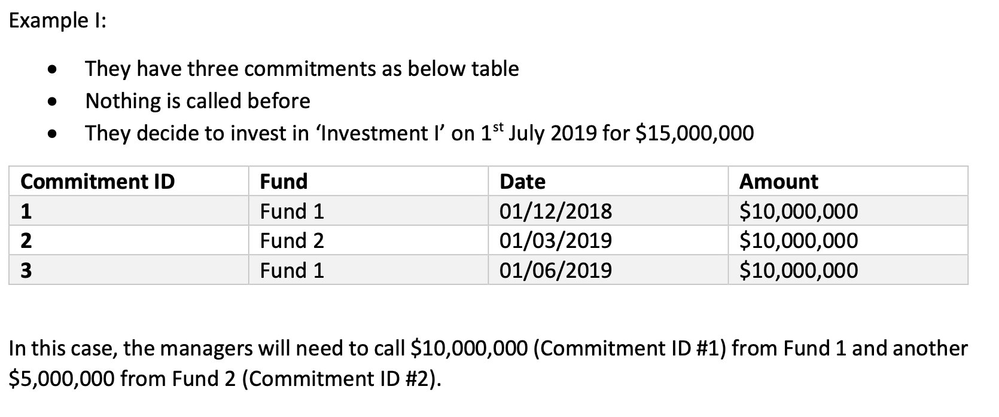
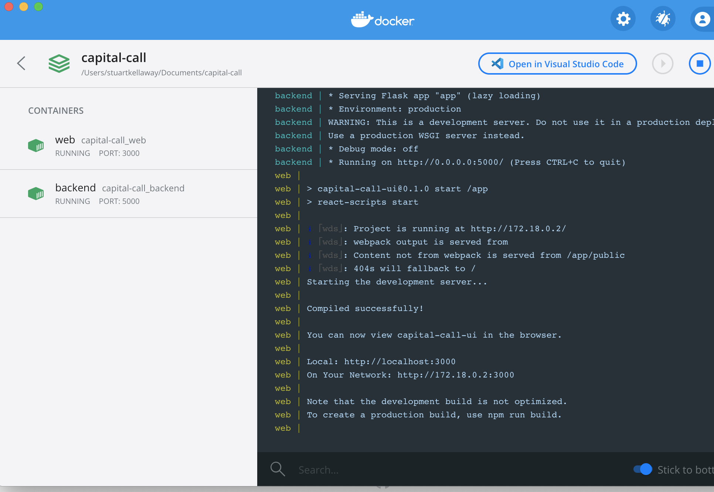

# Capital Call Investment Calculator

The fund managers need a system to determine which investor(s) they need to call in order to invest in a new investment. The methodology they implement is ‘First In, First Out (FIFO)’ – please find examples below for how it works.

## Tech Stack

* Backend service using Python Flask with an SQLite Database
* Frontend UI using React and nginx
* Both services containerized using Docker

## Quick Start using Docker Compose

* Install Docker
* Checkout this project from Git
* Run `docker-compose -f docker-compose.yml up -d --build` in the project root folder
* Access the frontend UI at http://localhost:3000

